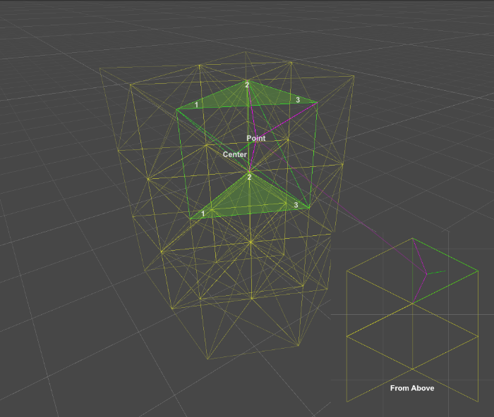
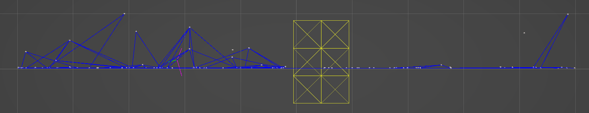

<h1 align="center">
	
	 
	Prism Based Grid Caching
</h1>

	
	
	
	

It's a common optimization practice to partion large amounts of objects into grids. Given any point or object in space, nearby objects can be found by searching only the grid partions in proximity to the point or object. A simple and popular approach for calculating the grid index utilizes squares (2D) or cubes (3D) which rounds the input position into a chunk given an arbitrary size.

While convenient, cubes are not entirely efficient. This method proposes the usage of triangles (2D) and prisms (3D) for index caching. A cube has 8 total points while a prism has 6. Nearby objects can be found by searching proximal partitions. It should be noted that searching all adjacent grids is redundant. It's only necessary to search immediately adjcent grids given a point. Additionally, this method caches the object directly to the 3 nearest corners of the current prism (or 2 given a triangle). Mitigating the search of nearby partitions during lookup. This trades off more memory usage and slower index caching speeds for faster index searching speeds. An object only needs to be indexed upon moving a considerable distance. Whereas searching may be a constant process.

When indexing, each grid needs a unique key to represent it for the partition. The spatial coordinates can be converted into a 32-bit integer, which limits each dimension to 1024 partitions. A 64-bit integer is used for larger spaces, limiting each dimension to 2,097,152 partitions. The spatial encoder also supports 8-bit and 16-bit for *very* small grid spaces. Each coordinate's axes are encoded into an n-bit integer using bit-shifting.

Objects are cached into the 3 nearest corners of the current prism on an infinite 3-dimensional grid using the encoded integer. Furthermore, by looking up an object's indexes in the cache, nearby objects can be discovered. This is useful for a multitude of applications where objects are interdependent.

# Dependencies

This project was built in Unity and C#. Adaptability was considered in development, so converting to usage independent of Unity should be simple. Unity specific functions are be isolated to the [Debug folder](Debug). Mathematics otherwise throughout the project utilizes the [Unity.Mathematics](https://docs.unity3d.com/Packages/com.unity.mathematics@1.1/manual/index.html) library.